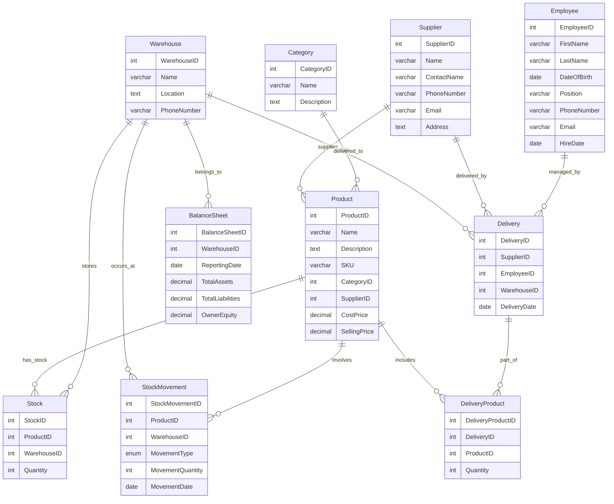
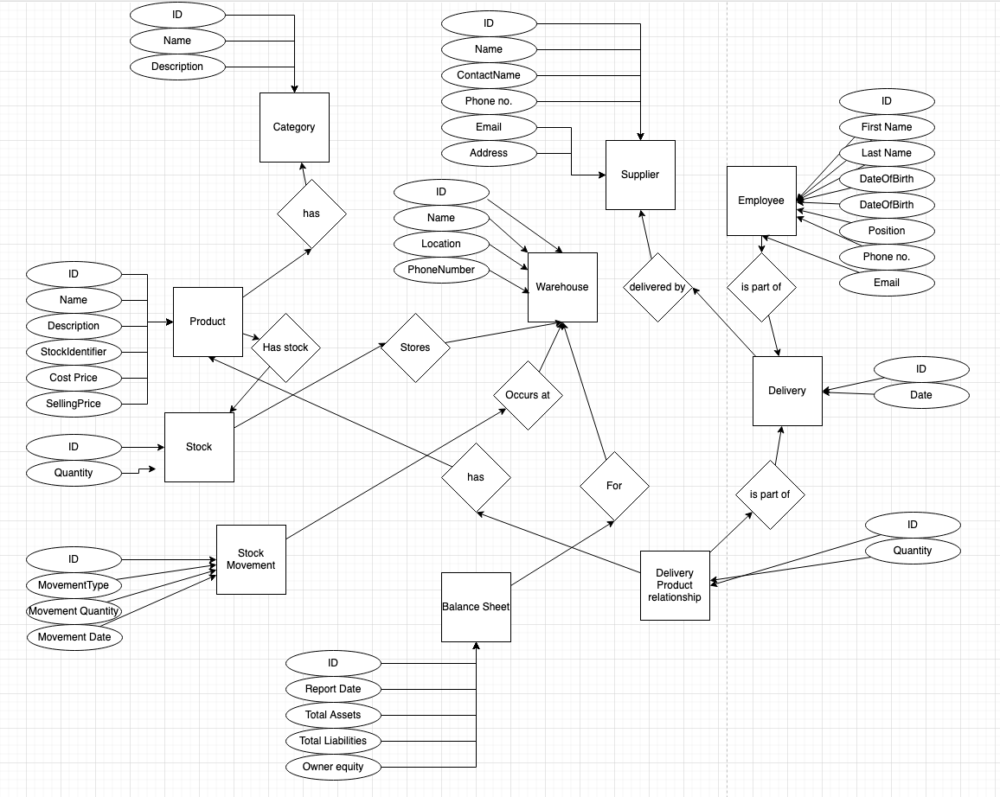

# Lielā praktiskā darba 3. nodevums - Grupas darbs

## Dalībnieki:
1. el22074, Emīls Lībeks
2. aj22075, Aleksandrs Jurinovs

## Biznesa pamatojums

### Projekta nosaukums: Interneta Veikala Noliktavas datubāzes izstrāde
### Biznesa nepieciešamība:
Mūsdienās ir ļoti aktuāli interneta veikali, ar laiku tie jau ir pierādījuši, ka tos var stabili
izmantot neuztraucoties pār preces atnākšanu un kvalitāti. Ar katru dienu pāliek vairak jo
vairāk jauni interneta veikali, gan ar e-precēm, gan ar fiziskajām, gan jauni veikali, gan jau
eksistējoši fiziski veikali, veido arī iespēju iepirkties elektroniski. Viens no galvenajiem
faktoriem, kuri ietekmē preces pārdošanu elektroniskajos veikalos, ir ērts saits ar dažādiem
filtriem un preču klasifikācija. Konkurence ir liela un ir jāuzlabo un jaatjaunina datubāzes pēc
iespējas biežāk, lai izcelties no konkurentiem, tiem, kuriem būs ērtāka klasifikācija uzvarēs
interneta veikalu sacencībās.
Interneta veikala nodrošināšanai ir nepieciešamas divu veidu datubāzes. Viena kas satur
klientu, preču un pasūtījumu informāciju, otra kas satur piegāžu, noliktavas, grāmatvedības
uzskaites informāciju. Datubāzes ir nepieciešamas interneta veikala aizmugures procesu
veikšanai. Tā vairāk kalpos un pildīs CRM vai Inventory/Warehouse datubāze.
Datubāzes mērķis ir:
sasaistīt un nodrošināt piegādes ķēdes darbību.
nodrošināt, noliktavas uzskaiti un pārskatus.
nodrošināt, grāmatvedības uzskaiti un pārskatus.
Biznesa nodrošināšanai būs nepieciešams ievērot šādas prasības:

1. Datubāzei ir jābūt pieejamai visiem darbiniekiem.
2. Datubāze nebūs pieejama klientiem.
3. Datubāzei ir jābut drošai, ātrai un uzticamai.
4. Datubāzei ir jābūt viegli pārvaldāmai, paplašināmai.
5. Datubāzei ir jābūt savstarpēji saistītai.

Datubāzes galvenais mērķis ir sasaistīt un nodrošināt Piegādes ķēdes darbību.
Datubāzes mērķis ir nodrošināt, noliktavas uzskaiti un pārskatus.
Datubāzes mērķis ir nodrošināt, grāmatvedības uzskaiti un pārskatus.
## Datubāzes struktūra
Datubāze var saturēt tādas tabulas kā:
1. Piegādes
2. Noliktava
3. Grāmatvedības uzskaites
4. Pārskati
5. Darbinieki
6. Klienti
7. Piegādātāji
8. Pasūtījumi
9. Produkti

## Crows Feet ER Diagram

## CHEN ER Diagram

