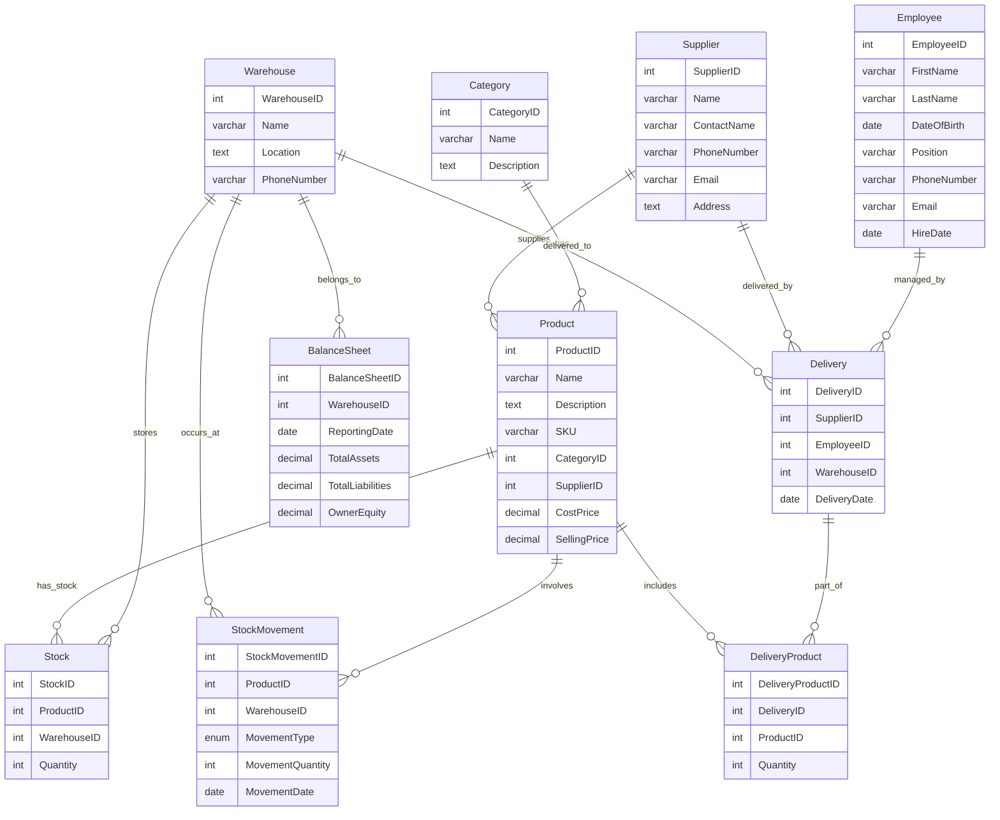

```mermaid
erDiagram
    Category ||--o{ Product : has
    Supplier ||--o{ Product : supplies
    Warehouse ||--o{ Stock : stores
    Product ||--o{ Stock : has_stock
    Product ||--o{ StockMovement : involves
    Warehouse ||--o{ StockMovement : occurs_at
    Employee ||--o{ Delivery : managed_by
    Supplier ||--o{ Delivery : delivered_by
    Warehouse ||--o{ Delivery : delivered_to
    Delivery ||--o{ DeliveryProduct : part_of
    Product ||--o{ DeliveryProduct : includes
    Warehouse ||--o{ BalanceSheet : belongs_to
    
    Category {
        int CategoryID
        varchar Name
        text Description
    }
    
    Supplier {
        int SupplierID
        varchar Name
        varchar ContactName
        varchar PhoneNumber
        varchar Email
        text Address
    }
    
    Warehouse {
        int WarehouseID
        varchar Name
        text Location
        varchar PhoneNumber
    }
    
    Product {
        int ProductID
        varchar Name
        text Description
        varchar SKU
        int CategoryID
        int SupplierID
        decimal CostPrice
        decimal SellingPrice
    }
    
    Stock {
        int StockID
        int ProductID
        int WarehouseID
        int Quantity
    }
    
    StockMovement {
        int StockMovementID
        int ProductID
        int WarehouseID
        enum MovementType
        int MovementQuantity
        date MovementDate
    }
    
    Employee {
        int EmployeeID
        varchar FirstName
        varchar LastName
        date DateOfBirth
        varchar Position
        varchar PhoneNumber
        varchar Email
        date HireDate
    }
    
    Delivery {
        int DeliveryID
        int SupplierID
        int EmployeeID
        int WarehouseID
        date DeliveryDate
    }
    
    DeliveryProduct {
        int DeliveryProductID
        int DeliveryID
        int ProductID
        int Quantity
    }
    
    BalanceSheet {
        int BalanceSheetID
        int WarehouseID
        date ReportingDate
        decimal TotalAssets
        decimal TotalLiabilities
        decimal OwnerEquity
    }

```
## CHEN ER Diagram

<!---
Fix this code!
-->

```mermaid

graph TB
    A[Category] --> A1[CategoryID]
    A --> A2[Name]
    A --> A3[Description]
    B[Product] --> B1[ProductID]
    B --> B2[Name]
    B --> B3[Description]
    B --> B4[SKU]
    B --> B5[CategoryID]
    B --> B6[SupplierID]
    B --> B7[CostPrice]
    B --> B8[SellingPrice]
    C[Supplier] --> C1[SupplierID]
    C --> C2[Name]
    C --> C3[ContactName]
    C --> C4[PhoneNumber]
    C --> C5[Email]
    C --> C6[Address]
    D[Warehouse] --> D1[WarehouseID]
    D --> D2[Name]
    D --> D3[Location]
    D --> D4[PhoneNumber]
    E[Stock] --> E1[StockID]
    E --> E2[ProductID]
    E --> E3[WarehouseID]
    E --> E4[Quantity]
    F[StockMovement] --> F1[StockMovementID]
    F --> F2[ProductID]
    F --> F3[WarehouseID]
    F --> F4[MovementType]
    F --> F5[MovementQuantity]
    F --> F6[MovementDate]
    G[Employee] --> G1[EmployeeID]
    G --> G2[FirstName]
    G --> G3[LastName]
    G --> G4[DateOfBirth]
    G --> G5[Position]
    G --> G6[PhoneNumber]
    G --> G7[Email]
    G --> G8[HireDate]
    H[Delivery] --> H1[DeliveryID]
    H --> H2[SupplierID]
    H --> H3[EmployeeID]
    H --> H4[WarehouseID]
    H --> H5[DeliveryDate]
    I[DeliveryProduct] --> I1[DeliveryProductID]
    I --> I2[DeliveryID]
    I --> I3[ProductID]
    I --> I4[Quantity]
    J[BalanceSheet] --> J1[BalanceSheetID]
    J --> J2[WarehouseID]
    J --> J3[ReportingDate]
    J --> J4[TotalAssets]
    J --> J5[TotalLiabilities]
    J --> J6[OwnerEquity]

    subgraph Category_Product_Supplier
        A1 --1--> B5
        B6 --*--> C1
    end

    subgraph Warehouse_Stock_Product
        D1 --1--> E3
        E2 --*--> B1
    end

    subgraph Product_StockMovement_Warehouse
        F2 --1--> B1
        F3 --*--> D1
    end

    subgraph Employee_Delivery_Supplier
        G1 --1--> H3
        H2 --*--> C1
    end

    subgraph Delivery_DeliveryProduct_Product
        I2 --1--> H1
        I3 --*--> B1
    end

    subgraph Warehouse_BalanceSheet
        J2 --1--> D1
    end


```

